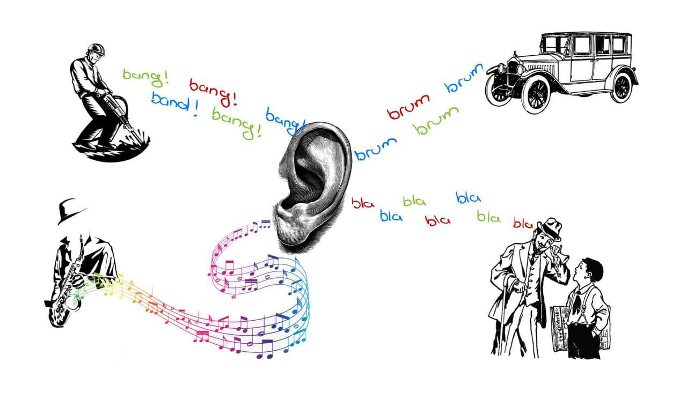
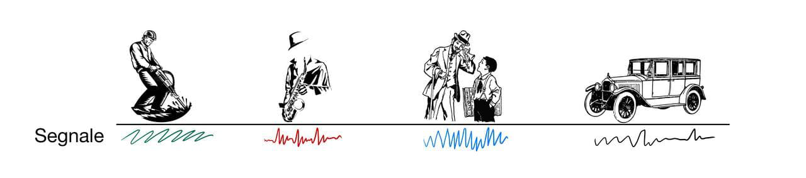
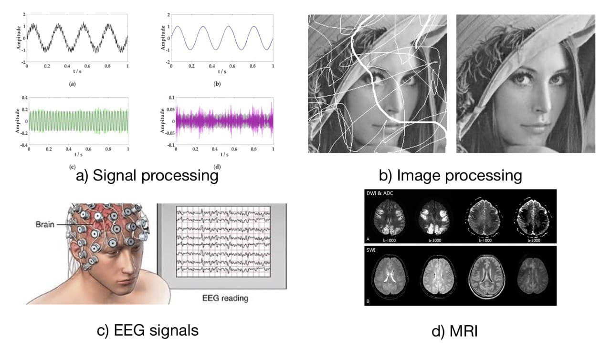
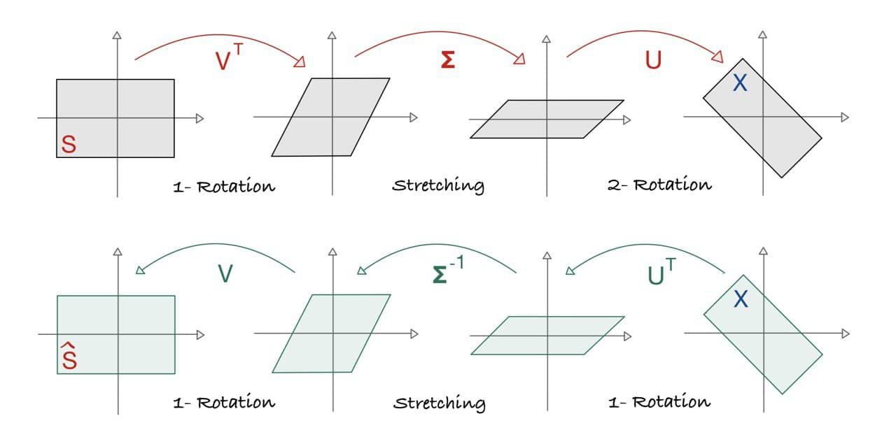
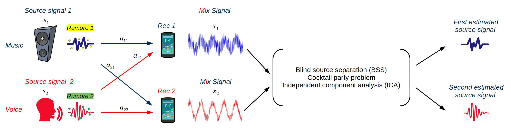
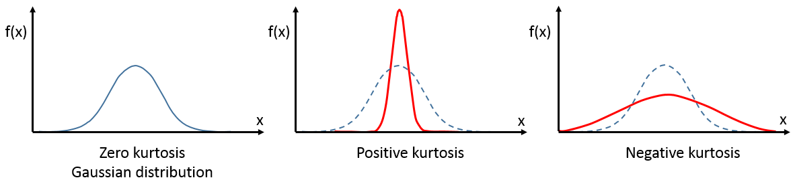

```{r setup, include=FALSE}
knitr::opts_chunk$set(echo = TRUE)
```

## INTRODUZIONE

L’analisi delle componenti indipendenti (ICA, independent component analysis) è una tecnica per rappresentare un set di variabili tramite un nuovo insieme più compatto di nuove variabili latenti indipendenti.

* Obiettivi:
    + descrivere in dettaglio l’analisi a componenti indipendenti e i relativi algoritmi di stima (in particolare FastICA);
    + descrivere le implementazioni disponibili in R;
    + presentare un esempio realistico in R.

Costituisce il problema di ottenere la separazione di componenti indipendenti dall'osservazione dei soli dati che sono una combinazione lineare dei componenti indipendenti. Nella vita reale ogni istante ascoltiamo una combinazione lineare di segnali provenienti da sorgenti differenti.  
Immaginiamo di passeggiare in piazza al centro di Bari vecchia, quello che le nostre orecchie riescono a percepire è una combinazione lineare di segnali provenienti da diversi sorgenti, contenente anche dei rumori di sottofondo. Non abbiamo dei poteri magici come nella saga "*The vampire diaries*" dove i vampiri riescono a concentrarsi e ad ascoltare un segnale alla volta.

Per esempio nello stesso tempo riusciamo a sentire il parlato di diverse persone, bambini che piangono, rumori di diverso tipo pensiamo al tram, alle macchine, musica..., etc.(Fig.1)

```{r out.height = "150px", out.width='300px', echo=FALSE, fig.cap=c("I singoli segnali provenienti da sorgenti indipendenti si uniscono per formare quello che chiamiamo combinazione lineare/segnale misto."), fig.align='center'}

```

\newpage

L'obiettivo è di ricavare dal segnale misto quindi dalla combinazione lineare in qualche modo i singoli segnali che lo compongono (quello che otteniamo sono delle *STIME*). Dall'esempio visto in fig.1, dobbiamo essere in grado di distinguere il segnale proveniente dal lavoratore, dal musicista, etc.(Fig.2)

```{r out.height = "200px", out.width='400px', echo=FALSE, fig.cap=c("I singoli segnali provenienti da sorgenti indipendenti."), fig.align='center'}

```  

Questo problema è conosciuto anche come ***cocktail party problem***, che è un esempio di ***blind signal separation (BSS)***/***blind source separation***.
*Blind* in quanto non conosciamo niente dalla provenienza dei segnali. ICA è una delle tecniche di machine learning che viene utilizzata per risolvere questo tipo di problema, ovvero decodificare i singoli segnali da un segnale misto.

Applicazioni della tecnica:

+ acoustic signal processing;
+ analysis of photografic images;
+ EEG, MEG, MRI signals;
+ financial data;
+ etc.

```{r out.height = "200px", out.width='400px', echo=FALSE, fig.cap=c("Qualche esempio dove ICA ha trovato applicazione."), fig.align='center'}

```

\newpage

## MODELLIZZAZIONE

\noindent\rule{\textwidth}{1pt}
\newline
In generale siano $\mathbf x_1, \dots, \mathbf x_m$ dati osservati dalla combinazione lineare di $\mathbf s_1, \dots, \mathbf s_n$ dati originali con $m \geq n$ tramite la matrice dei pesi $A$. Vogliamo recuperare i componenti indipendenti $\mathbf s_i$ non avendo nessuna informazione sulla distribuzione di $\mathbf s_i$ e sulla matrice $A$.

Essendo $\mathbf x_i$ una combinazione lineare possiamo scrivere:

$$
\mathbf x_i = \sum_{j=1}^n a_{ij} \mathbf s_j \hspace{10 mm} i=1,\dots,m
$$

Definiamo le matrici:

+ $X \in \mathbb{R}^{m \times p}$ matrice dei dati osservati; 
+ $S \in \mathbb{R}^{n \times p}$ matrice dei dati originali;
+ $A \in \mathbb{R}^{m \times n}$ mixing matrix, matrice con rank massimo, quindi la matrice è invertibile.

$$
\begin{pmatrix}
\mathbf x_1 \\
\mathbf x_2 \\
\vdots \\
\mathbf x_m  
\end{pmatrix}
=
\begin{pmatrix}
a_{11} & a_{12} & \dots  & a_{1n} \\
a_{21} & a_{22} & \dots  & a_{2n} \\
\vdots & \vdots & \ddots & \vdots \\
a_{m1} & a_{m2} & \dots  & a_{mn}
\end{pmatrix}
\begin{pmatrix}
\mathbf s_1 \\
\mathbf s_2 \\
\vdots \\
\mathbf s_n 
\end{pmatrix}
$$

+ $X \in \mathbb{R}^{m \times p}$ rappresenta lo spazio generato da i dati osservati, e $m$ indica il numero dei dati osservati.
+ $S \in \mathbb{R}^{n \times p}$ rappresenta lo spazio generato da i dati originali, e $n$ indica il numero dei dati originali.

Per semplicità in questo elaborato la matrice $A$ verrà considerata come una matrice quadrata cosi come viene proposta nella letteratura. Il che significa che il numero dei dati originali coincide con il numero dei dati osservati.

Ridefiniamo le matrici:

+ $X \in \mathbb{R}^{N \times p}$ matrice dei dati osservati; 
+ $S \in \mathbb{R}^{N \times p}$ matrice dei dati originali;
+ $A \in \mathbb{R}^{N \times N}$ mixing matrix, matrice con rank massimo, quindi la matrice è invertibile.

$$
\begin{pmatrix}
\mathbf x_1 \\
\vdots \\
\mathbf x_N  
\end{pmatrix}
=
\begin{pmatrix}
a_{11}  & \dots  & a_{1N} \\
\vdots  & \ddots & \vdots \\
a_{N1}  & \dots  & a_{NN}
\end{pmatrix}
\begin{pmatrix}
\mathbf s_1 \\
\vdots \\
\mathbf s_N
\end{pmatrix}
$$
\newline
\noindent\rule{17cm}{0.4pt}

***Notazione:***

In questo elaborato le matrici verranno denotate con le lettere in maiuscolo esempio: $X$, $S$, $A$. 

I vettori verranno denotati con le lettere in minuscolo in grassetto esempio $\mathbf x$, $\mathbf s$, $\mathbf a$.

\newpage

### ASSUNZIONI DI ICA

1. Si assume che i segnali sono mutuamente indipendenti;
    + $p(\mathbf s_i,\mathbf s_j)=p(\mathbf s_i)p(\mathbf s_j)$
2. La distribuzione di $\mathbf s_i$ è non-Gaussiana;
    + $p(\mathbf s_i)= \prod_{j = 1}^{N} p_j(\mathbf s_{ij})$
3. I dati osservati siano centrati sulla media: $\mu_{x_i}=0$;
4. In questo lavoro assumiamo per semplicità che i dati non siano affetti da rumore;

In seguito alle assunzioni del modello ICA è importante fornire alcuni concetti fondamentali che stanno alla base di ICA:
\noindent\rule{17cm}{0.4pt}
**Incorrelazione**

Due variabili aleatorie $\mathbf x$ e $\mathbf y$ si dicono incorrelate tra loro se la loro covarianza è nulla:

+ $\sigma_{\mathbf x\mathbf y} = Cov(\mathbf x,\mathbf y) = 0$

Se $\mathbf x$ e $\mathbf y$ sono statisticamente indipendenti sia nel caso continuo che discreto otteniamo che:

+ $\sigma_{\mathbf x\mathbf y} = 0$
    + Quindi se $\mathbf x$ e $\mathbf y$ sono indipendenti, ne consegue che la loro covarianza è nulla, ovvero diciamo che abbiamo **assenza di associazione**, ciò non implica l'assenza di una qualsiasi relazione tra $\mathbf x$ e $\mathbf y$.
    + Quando i dati provengono da una distribuzione gaussiana la covarianza = 0. Siccome la covarianza viene utilizzata per calcolare la direzione con più informazione, nel caso Gaussiano non possiamo dire niente.
    
Si costruisce cosi la matrice di ***Covarianza***, esempio variabile aleatoria multipla $X = (\mathbf x_1, \dots,\mathbf x_p)$:
$$
\begin{pmatrix}
Var(X_1) & Cov(X_1,X_2) & \dots & Cov(X_1,X_P) \\
Var(X_2,X_1) & Var(X_2) & \dots & Cov(X_2,X_P) \\
\vdots & \vdots & \ddots & \vdots \\
Var(X_p,X_1) & Var(X_p,X_2) & \dots & Var(X_P)
\end{pmatrix}
$$

**Indipendenza**

Le componenti marginali di $X = (\mathbf x_1, \dots,\mathbf x_p)$ si dicono **mutuamente indipendenti** se:

+ $f_X(x_1,\dots,x_p) = f_1(x_1) \times \dots \times f_p(x_p) = \prod_{i = 1}^{p} f_i(x_i)$
+ Per quanto detto sopra la matrice di covarianza diventa:
$$
\begin{pmatrix}
\sigma_{11} & 0 & \dots & 0 \\
0 & \sigma_{22} & \dots & 0 \\
\vdots & \vdots & \ddots & \vdots \\
0 & 0 & \dots & \sigma_{pp}
\end{pmatrix}
$$

\noindent\rule{17cm}{0.4pt}

\newpage

### L'OBIETTIVO DI ICA

L'obiettivo di ICA è di stimare la matrice $W=A^{-1}$ per poter stimare i componenti indipendenti $S$.

+ $X = AS$;
    + $A^{-1}X = A^{-1}AS$;
    + $S = A^{-1}X$
+ $Y = WX \approx S$;

ICA prova di trovare $A$ utilizzando la sua decomposizione ai valori singolari, conosciuta come SVD (Singular Value Decomposition). La quale è una fattorizzazione di una matrice come prodotto di tre matrici:

+ $A = U \Sigma V^T$
+ $W$ idealmente deve essere: $W = A^{-1} = V \Sigma^{-1} U^T$

**Decomposizione ai valori singolari (SVD)**
    
* Dall'algebra lineare sappiamo che:
    + Sia la matrice $A \in \mathbb{R}^{m \times n}$, matrice con rank massimo;
    \
    + Sia $k=rank(A) \le min(m,n)$; \
    + Allora:
        + $\exists  U \in \mathbb{R}^{m \times m}$, matrice ortonormale: $U^T = U^{-1}$, $U^T U = I_m =  U  U^T$;
        + $\exists  V \in \mathbb{R}^{n \times n}$, matrice ortonormale: $V^T =  V^{-1}$, $V^T  V =  I_n =  V  V^T$;
        + $\exists  \Sigma \in \mathbb{R}^{m \times n}$, matrice diagonale a blocchi, dove le prime k righe e le prime k colonne costituiscono la matrice diagonale, nella diagonale principale troviamo i valori singolari ovvero $(\sigma_1,\sigma_2,...,\sigma_k | \sigma_1 \ge \sigma_2 \ge...\ge\sigma_k)$ della matrice $A$;
        + $U = \begin{pmatrix} \mathbf u_1 & \mathbf u_2 & \cdots & \mathbf u_k & \cdots & \mathbf u_m \end{pmatrix}$, le $\mathbf u_i \in \mathbb{R}^m$ vengono chiamati vettori singolari di sinistra;
        + $V = \begin{pmatrix} \mathbf v_1 & \mathbf v_2 & \cdots & \mathbf v_k & \cdots & \mathbf v_m \end{pmatrix}$, le $\mathbf v_i \in \mathbb{R}^n$ vengono chiamati vettori singolari di destra; \
    + Per ricavare $U$ si calcola la matrice quadrata $A A^T \in \mathbb{R}^{m \times m}$:
        + $A A^T = ( U  \Sigma  V^T)( V  \Sigma^T  U^T) =  U ( \Sigma  \Sigma^T)   U^T$:
            + $A  A^T =  U diag(\sigma_1^2,\sigma_2^2, \cdots, \sigma_k^2,0, \cdots,0)  U^T$;
            + $\sigma_i^2$ sono gli autovalori di $A A^T$;
            + $\mathbf u_i$ sono gli autovettori di $A  A^T$;
            + $A A^T$ codifica in se le informazioni sulle colonne di $A$, (feature); \
    
    + Per ricavare $V$ si calcola la matrice quadrata $A^T A \in \mathbb{R}^{n \times n}$:
        + $A^T  A = ( V  \Sigma^T  U^T)( U  \Sigma  V^T) =  V ( \Sigma^T  \Sigma)   V^T$
            + $A^T  A =  V diag(\sigma_1^2,\sigma_2^2, \cdots, \sigma_k^2,0, \cdots,0)  V^T$;
            + $\sigma_i^2$ sono gli autovalori di $A^T  A$;
            + $\mathbf v_i$ sono gli autovettori di $A^T A$;
            + $A^T  A$ codifica in se le informazioni sulle righe di $A$, (campioni);

\newpage

### SVD E ICA

* Sia la matrice $A \in \mathbb{R}^{nxn}$, matrice quadrata, quindi abbiamo n combinazioni lineari da n dati originali.
    + $X = AS$
    + $A = U \Sigma V^T$
    + $X = (U \Sigma V^T) S$

```{r out.height = "200px", out.width='400px', echo=FALSE, fig.cap=c("Rappresentazione geometrica del passaggio dallo spazio generato dai dati originali allo spazio generato dai dati osservati e viceversa."), fig.align='center'}

```

Nella fig.4 si rappresenta in modo geometrico la potenza del svd. In alto abbiamo la trasformazione dello spazio generato da $S$, nello spazio dei dati osservati $X$.
In questo caso stiamo supponendo di conoscere sia i dati originali $S$ e sia la matrice dei pesi della combinazione lineare $A$.

+ I passi per passare nello spazio generato dai dati osservati $X$:
    + La prima rotazione avviene applicando la matrice di rotazione $V^T$:
        + $V^TS$
    + Come secondo passaggio abbiamo lo streching grazie ai valori singolari presenti in $\Sigma$:
        + $\Sigma(V^TS)$
    + La seconda e ultima rotazione si ottiene grazie all'applicazione della matrice di rotazione $U$:
        + $U(\Sigma V^TS)$
    + $X = U \Sigma V^T S$
    
Quello che facciamo con ICA è il processo inverso di quanto visto sopra. Noi non conosciamo né la matrice $A$ e né i dati originali e quindi la matrice $S$. Conosciamo solo la matrice dei dati osservati $X$, e a partire da essa dobbiamo stimare le matrici $U$, $\Sigma$ e $V$, per poter cosi stimare:

+ $W = (U \Sigma V^T)^{-1}$
+ $Y = W X$

\newpage

Di seguito proviamo a stimare le tre matrici in due passi:

+ Grazie alla covarianza dei dati possiamo stimare $U^T$ e la matrice $\Sigma^{-1}$;
+ Grazie alla indipendenza e curtosi stimiamo la matrice $V$;

**Esempio**:

```{r out.height = "200px", out.width='400px', echo=FALSE, fig.cap=c("Esempio bidimensionale."), fig.align='center'}

```

Tramite questo esempio in $\mathbb{R}^2$ osserviamo come si presentano i segnali e le loro proprietà in più vediamo graficamente come lo spazio generato da $S$ si trasforma nello spazio generato da $X$ passo dopo passo(prima parte della fig.4). In questo esempio stiamo considerando di avere 2 segnali originali, registrati da i due dispositivi, e come output abbiamo 2 segnali osservati.

$$
\begin{pmatrix} \mathbf x_1 \\ \mathbf x_2 \end{pmatrix}
=
\begin{pmatrix} 
a_{11} & a_{12} \\
a_{21} & a_{22}
\end{pmatrix}
\begin{pmatrix} \mathbf s_1 \\ \mathbf s_2 \end{pmatrix}
$$

```{r}
set.seed(888)

n <- seq(0, 9, length.out=1000) # dividiamo il segmento [0:9] in 1000 parti

s1 <-  sin(2 * n)  # Segnale 1 : segnale sinusoidale
s2 <-  runif(1000)- 0.1 # Segnale 2: generato da una distribuzione uniforme

S <- rbind(s1,s2) # creazione della matrice dei dati originali

A <- matrix(c(1, 1, 1, -2), nrow = 2, ncol = 2) # Mixing matrix

X <- A %*% S # Creazione della matrice dei dati osservati

```

Otteniamo la matrice dei dati osservati grazie alla combinazione lineare dei dati originali:
$$
\begin{pmatrix} x_{11} & x_{12} & \dots & x_{11000}\\ x_{21} & x_{22} & \dots & x_{21000} \end{pmatrix}
=
\begin{pmatrix} 
1 & 1 \\
1 & -2
\end{pmatrix}
\begin{pmatrix} s_{11} & s_{12} & \dots & s_{11000}\\ s_{21} & s_{22} & \dots & s_{21000} \end{pmatrix}
$$

\newpage

Osserviamo i grafici dei segnali indipendenti che non provengono da una distribuzione Gaussiana e la loro rappresentazione tramite istogramma:

```{r echo=FALSE}
par(mfrow=c(2,2))
# Segnale 1
plot(s1, col="blue", type="l", main = "Segnale s1", xlab = "n", ylab = "s1")
hist(s1, col="blue", main = "Istogramma s1")

# Segnale 2
plot(s2, type="l",main = "Segnale s2", xlab = "n", ylab = "s2")
hist(s2, main = "Istogramma s2")
```

\newpage

Osserviamo come si presentano i grafici dei segnali osservati e cosa succede alla loro rappresentazione tramite istogramma:

```{r}
par(mfrow=c(2,2))
# Segnale osservato 1
plot(X[1,], col="blue", type="l", main = "Segnale osservato x1", xlab = "n", ylab = "x1")
hist(X[1,], col="blue", main = "Istogramma x1", xlab = "x1")

# Segnale osservato 2
plot(X[2,], type="l",main = "Segnale osservato x2", xlab = "n", ylab = "x2")
hist(X[2,], main = "Istogramma x2", xlab = "x2")
```

Nella base di ICA troviamo il ***TEOREMA DEL LIMITE CENTRALE***. Il teorema afferma che la media campionaria per $n \rightarrow \infty$, diventa probabilisticamente indistinguibile da una Gaussiana con valore atteso $\mu$ e varianza $\frac {\sigma^2}{n}$ qualunque sia la forma delle osservazioni campionarie di partenza.

Tornando al'obiettivo di ICA, vogliamo stimare $W$ tale che: $Y=WX=WAS\approx S$ sia molto vicina ai componenti indipendenti. Questo lo possiamo vedere come il processo inverso del teorema del limite centrale.

Quindi grazie alla combinazione lineare i segnali osservati sono necessariamente più Gaussiane rispetto ai segnali originali. L'obiettivo può essere raggiunto trovando $W$ che ci massimizza la non-Gaussianità di $Y$. Vedremmo più avanti quali sono le misure che ci aiutano a calcolare la non-Gaussianità.


\newpage

```{r}
# Calcoliamo la decomposizione SVD di A
A.svd <- svd(A)
```

**I passi della trasformazione:**
    
(1) $V^T S$
(2) $\Sigma (V^T S)$
(3) $U (\Sigma V^T S)$
    
```{r}
# 1.Applichiamo la prima rotazione V
prima.rot.V <- t(A.svd$v) %*% S
# 2.Applichiamo la Sigma
seconda.d <- diag(A.svd$d) %*% prima.rot.V
# 3.Applichiamo la rotazione U
ultimaRotazione.U <- A.svd$u %*% seconda.d
```

```{r echo=FALSE}
par(mfrow=c(2,2))
# Spazio generato da S
plot(S[1,], S[2,],main = "Spazio generato da S", xlab = "s1", ylab = "s2")

# Applicazione prima rotazione
plot(prima.rot.V[1,], prima.rot.V[2,],main = "Rotazione V")

# Applicazione di Sigma
plot(seconda.d[1,], seconda.d[2,],main = "Applicazione di Sigma")

# Applicazione ultima rottazione
plot(ultimaRotazione.U[1,], ultimaRotazione.U[2,],main = "Rotazione U")
```

\newpage

### SBIANCAMENTO DEI DATI

Per semplicità prendiamo sempre l'esempio bidimensionale, i dati osservati si presentano nella forma:
$$
\begin{pmatrix}
\mathbf x_1 \\
\mathbf x_2
\end{pmatrix}
=
\begin{pmatrix} x_{11} & x_{12} & \dots & x_{11000}\\ x_{21} & x_{22} & \dots & x_{21000} \end{pmatrix}
$$
Prima di applicare qualsiasi algoritmo che esegue l'estrazione dei componenti indipendenti i dati di input devono essere centrati e sbiancati.

Centrare i dati è molto semplice, basta togliere da ogni elemento degli variabili osservati la loro media:

+ $media = \frac{1}{p} \sum_{i=1}^p \mathbf x_i$
+ $\mathbf x_{ij} = \mathbf x_{ij} - media$


```{r}
# Centriamo i dati osservati
datiCentrati <- function(X){
  media <- rowMeans(X)
  return(X-media)
}

X_centrato <- datiCentrati(X)

summary(t(X_centrato))
```

```{r echo=FALSE}
par(mfrow=c(1,2))

plot(X[1,], X[2,] ,main = "Segnale osservato x1", xlab = "x1", ylab = "x2")
plot(X_centrato[1,],X_centrato[2,] ,main = "Segnale osservato centrato", xlab = "x1", ylab = "x2")
points(0,0,col="red")
```

Lo sbiancamento dei dati non è altro che una trasformazione lineare che trasforma un vettore di variabili aleatorie con una matrice di covarianza in un nuovo vettore dove la matrice di covarianza coincide con la matrice d'identità. Come abbiamo visto sopra ciò significa che le variabili sono non correlati tra loro e ogni variabile ha una varianza unitaria.

Un metodo comune che viene utilizzato per lo sbiancamento dei dati è la decomposizione spettrale della matrice di covarianza di $X$.

+ $XX^T = (AS)(AS)^T$

+ $\hspace{9 mm} = (U \Sigma V^T S)(U \Sigma V^T S)^T$ 

+ $\hspace{9 mm} = U \Sigma V^T (SS^T) V \Sigma U^T$

+ $X X^T = U \Sigma^2 U^T$

Tutto ciò è equivalente alla ***Diagonalizzazione*** di una matrice:

Supponiamo che la matrice $A \in \mathbb{R}^{n\times n}$ abbia $n$ autovettori linearmente indipendenti. Se questi autovettori sono le colonne di una matrice $S$, allora $S^{-1}AS$ è una matrice diagonale $\Lambda$. Gli autovalori di $A$ sono nella diagonale principale di $\Lambda$:
$$
S^{-1}AS = \Lambda
=
\begin{pmatrix}
\lambda_1 & & &  \\
& \lambda_2 & &  \\
& & \ddots &    \\
& & & \lambda_n
\end{pmatrix}
$$

+ Chiamiamo $S$ la matrice degli autovettori;
+ Chiamiamo $\Lambda$ la matrice degli autovalori;
+ $A = S \Lambda S^{-1}$;

La matrice dei dati osservati sbiancata risulta cosi definita:
$$
X = U\Sigma^{-\frac{1}{2}}U^TX
$$
Lo sbiancamento lo possiamo fare applicando la PCA. In questo elaborato utilizzerò entrambi le procedure per far capire la loro equivalenza.

Grazie alla matrice di covarianza abbiamo detto che possimo stimare le prime due matrici che ci servono, $U$ e $\Sigma$, per esseguire il processo inverso rappresentato nella fig.4.

Sbianchiamo la nostra matrice dei dati osservati centrati:

```{r}
# Calcoliamo la matrice di covarianza
matriceCovarianza <- cov(t(X_centrato))
matriceCovarianza
```

\newpage

Per trovare le direzioni che puntano verso le varianze maggiori utilizziamo la PCA.

```{r}
pca <- prcomp(matriceCovarianza)
pca
```

Abbiamo appena trovato le due matrici di interesse:

+ $U$ Coincide con la matrice restituita da PCA *Rotation*;
+ $\Sigma^2$ coincide con la diagonalizzazione del vettore *Standard deviations*;

***Attenzione!*** sopra abbiamo trovato che la matrice di covarianza di $X$ è:
$X X^T =  U  \Sigma^2  U^T$, ma noi siamo interessati alla $\Sigma^{-1}$, quindi per togliere il quadrato dobbiamo calcolare $\Sigma^{-\frac{1}{2}}$.

```{r echo=FALSE}

# Prima ruotazione 
rot1 <- t(pca$rotation)%*%X_centrato

# Streching
d <- diag(1/sqrt(pca$sdev))
streching <- d %*% rot1

# Dati osservati whitened
X_white <- streching
```

```{r echo=FALSE}
layout(matrix(c(1,1,2,3), 2, 2, byrow = TRUE))
# Spazio generato X centrato
plot(X_centrato[1,],X_centrato[2,], main = "Spazio generato da X centrato", xlab = "x1", ylab = "x2")
arrows(0,0,pca$rotation[1,1],pca$rotation[2,1], col="red") #PC1
arrows(0,0,pca$rotation[1,2],pca$rotation[2,2], col="red") #PC2

# Applicazione prima ruotazione rispetto a pc1 e pc2
plot(rot1[1,], rot1[2,] ,main = "Prima ruotazione t(U)", xlab = "pc1", ylab = "pc2")

# X_whitened
plot(X_white[1,], X_white[2,] ,main = "Applicazione di Sigma", xlab = "x1", ylab = "x2")
```

L'ultima cosa rimasta da stimare è la matrice $V$ (fig.4), ovvero l'ultima ruotazione che ci permette di stimare la matrice dei coeficienti $W$ per poi stimare i seganli originali $Y$.

\newpage

### NON-GAUSSIANITÀ

+ Come vedremo nel prossimo capitolo, dopo aver centrato i dati osservati si va alla ricerca dei componenti principali, ovvero dobbiamo capire in che direzione abbiamo la varianza maggiore (relazione tra PCA e ICA). Questa cosa nel caso della distribuzione Gaussiana non è possibile. Osservando lo spazio generato da due distribuzioni Gaussiane in primis vediamo che si presenta nella forma di un cerchio quindi possiamo prendere qualsiasi rotazione delle componenti principali, non siamo in grado di dedurre le direzioni che rappresentano le direzioni principali. Se invece osserviamo lo spazio generato da una distribuzione Non-Gaussiana siamo in grado di trovare i componenti principali e ruotare rispetto ai nuovi assi.

+ ***Esempio esplicativo:***

```{r echo=FALSE, warning = FALSE}
library(ggplot2)
library(ggfortify)
library(patchwork)

segnale1 <- rnorm(1000)
segnale2 <- rnorm(1000)
segnale <- cbind(segnale1, segnale2)

pca_res <- prcomp(segnale, scale. = TRUE)

plot1 <- autoplot(pca_res, data = segnale,loadings = TRUE, loadings.colour = 'blue',
         loadings.label = TRUE, loadings.label.size = 5, main="Distribuzione Gaussiana")

# NON Gaussian
nCampioni <- 1000
n <- seq(0, 9, length.out=nCampioni)

s1n <-  sin(2 * n)  # Segnale 1 : sinusoidal signal
s2n <-  runif(nCampioni)- 0.1 # Segnale 2: generato da una distribuzione uniforme
segnale2 <- cbind(s1n,s2n)

pca_res <- prcomp(segnale2, scale. = TRUE)

par(mfrow=c(2,2))

plot2 <- autoplot(pca_res, data = segnale2,loadings = TRUE, loadings.colour = 'blue',
         loadings.label = TRUE, loadings.label.size = 5, main = "Distribuzione NON-Gaussiana")
plot1 + plot2

```

+ Nel primo processo di stima utilizziamo il $4^\circ$ momento che viene chiamato curtosi. Questa è un altra ragione per cui la distribuzione Gaussiana non va bene per i nostri dati in quanto la curtosi per le distribuzioni Gaussiane è pari a 0. E siccome noi dobbiamo minimizzare questa quantità in questo caso non possiamo farci niente.

\newpage

## MISURE DI NON-GAUSSIANITÀ 

\noindent\rule{\textwidth}{1pt}

### CURTOSI

Abbiamo trovato una soluzione parziale di $A$, $\Sigma$ contiene gli autovalori e $U$ contiene gli autovettori della matrice di covarianza di $X$.

Per l'ultimo passo si utilizza la Curtosi, la quale è definita come la forma normalizzata del quarto momento di una distribuzione:
$$
kurt(x) = E\{x^4\} - 3(E\{x^2\})^2
$$

Siccome abbiamo assunto $X$ centrato sulla media $\mu_X = 0$ e di avere varianza unitaria $\sigma_X^2 = E\{X^2\} - \mu_X^2 = 1$, e quindi $E\{X^2\}=1$ la curtosi lo vediamo come una versione normalizzata del $4^\circ$ momento:
$$
kurt(x) = E\{x^4\} - 3
$$

La curtosi misura il grado di quanto il grafico di una distribuzione sia appuntito (spikiness), ed è 0 solo per la distribuzione Gaussiana.

```{r out.height = "200px", out.width='400px', echo=FALSE, fig.cap=c("Curtosi."), fig.align='center'}

```

Come si può vedere nella fig.6 la curtosi può assumere valori:

+ positivi, diciamo che abbiamo una distribuzione super-Gaussiana
+ negativi, diciamo che abbiamo una distribuzione sub_Gaussiana

Per questo motivo il valore assoluto oppure il quadrato della curtosi può essere utilizzata per calcolare la non-Gaussianità di una distribuzione.

Vediamo qualche proprietà, se $\mathbf x_1$ e $\mathbf x_2$ sono due variabili aleatori indipendenti:

+ $kurt(\mathbf x_1 + \mathbf x_2) = kurt(\mathbf x_1) + kurt(\mathbf x_2)$
+ $kurt(\alpha\mathbf x_1) = \alpha^4 kurt(\mathbf x_1)$

Comunque anche se la curtosi è la misura più utilizzata in ICA è stato provato che non è molto robusto per la misura della non-Gaussianità di una distribuzione in quanto è molto sensitivo per quanto riguarda i outliers.

\newpage

Riprendiamo l'esempio, dobbiamo ancora calcolare l'ultima rottazione $V$:

Sappiamo che la matrice di rottazione nel caso bidimensionale è: 
$$V = \begin{pmatrix} cos\phi & sin\phi \\ -sin\phi & cos\phi\end{pmatrix}$$
Quello che dobbiamo fare è trovare l'angolo di rotazione $\phi_0$ [ref.2]:
$$
kurt(\phi) = \sum_{j=1}^N \left[ 
\overline{X_1}(j) \overline{X_2}(j)
\begin{pmatrix}
cos(\phi) \\ sin(\phi)
\end{pmatrix}
\right]^4
$$

+ dove $\overline{X_i}(j)$ sono i dati centrati e sbiancati.

+ Derivando $kurt(\phi)$ rispetto a $\phi$ otteniamo [ref.2]:
$$
\phi_0 = \frac{1}{4} tan^{-1}
\left(
\frac{- \sum_{j=1}^N 2\overline{X_1}^3(j)\overline{X_2}(j) - 2\overline{X_1}(j) \overline{X_2}^3(j)}
{\sum_{j=1}^N 3\overline{X_1}^2(j)\overline{X_2}^2(j) - \frac{1}{2}\overline{X_1}^4(j) -  \frac{1}{2}\overline{X_2}^4(j)}
\right)
$$

Quello che ci rimane da fare è sostituire nella matrice $V$ l'angolo calcolato $\phi_0$:
```{r}
x1bar <- as.vector(X_white[1,])
x2bar <- as.vector(X_white[2,])

Xbar <- cbind(x1bar, x2bar)

phi0 <- 0.25*atan( -sum(2*(x1bar^3)*x2bar-2*x1bar*(x2bar^3)) / 
                     sum(3*(x1bar^2)*(x2bar^2)-0.5*(x1bar^4)-0.5*(x2bar^4)))

V <- matrix(c( cos(phi0), sin(phi0), 
               -sin(phi0), cos(phi0)), ncol=2,byrow=TRUE)

Y <- V %*% X_white
```

\newpage

Osserviamo la matrice stimata $Y$ e quella originale, possiamo notare che la matrice stimata non ha lo stesso ordine come quella originale questa comporta anche un ordine diverso per le stime.

```{r}
# Matrice originale
A
```

```{r}
# Matrice stimata
V %*% d %*% pca$rotation
```

```{r echo=FALSE}
par(mfrow=c(2,2))
# Segnale originale s1
plot(S[1,], col="blue", type="l", main = "Segnale originale s1", xlab = "n", ylab = "s1")
# Segnale stimato s1
plot(Y[2,], col="blue", type="l", main = "Segnale stimato s1", xlab = "n", ylab = "stima s1")

# Segnale originale s2
plot(S[2,], col="blue", type="l", main = "Segnale originale s2", xlab = "n", ylab = "s2")
# Segnale stimato s2
plot(Y[1,], col="blue", type="l", main = "Segnale stimato s2", xlab = "n", ylab = "stima s2")
```

\newpage

### NEGENTROPIA

Un altra misura molto importante per la non-Gaussianità e data da *negentropia*. 
La negentropia e basata sul concetto di una quantità nella teoria dell‘Informazione chiamato *entropia*. 

L’entropia differenziale di un vettore aleatorio $\mathbf y$ con funzione di distribuzione $f(\mathbf y)$ è definita come:
$$
H(\mathbf y) = - \int f(\mathbf y) logf(\mathbf y)dy
$$

L'entropia di $\mathbf y$ si può vedere come misura del contenuto informativo associato ad $\mathbf y$. Più una variabile è causale ovvero imprevedibile e non strutturata più la sua entropia è elevata. 

Stiamo parlando di entropia in quanto è stato provato che le variabili Gaussiane hanno l‘entropia maggiore tra le variabili di uguale varianza. Per questo motivo tale misura è stata sfruttata per misurare la non-Gaussianità.

Per ottenere una misura della non-Gaussianetà positiva e che risulti nulla nel caso di variabili Gaussiane usiamo la negentropia $J$ e viene definita come:

$$
J(\mathbf y) = H(\mathbf y_{gauss}) - H(\mathbf y) \geq 0
$$

+ $\mathbf y_{gauss}$ è un vettore aleatorio gaussiano che ha la stessa matrice di covarianza di $\mathbf y$;
+ $J(\mathbf y) = 0$ solo nel caso quando $\mathbf y$ viene da una distribuzione Gaussiana.

Sembra tutto bello ma come sempre anche in questo caso risulta molto difficile calcolare la negentropia in quanto non conosciamo la funzione di distribuzione di probabilità.

Per questo motivo utilizziamo delle approssimazioni della negentropia, che permettono calcoli più semplici.

L'approssimazione più utilizzata basata sul principio di *maximum-entropy* è:
$$
J(y) \propto [E\{G(y)\} - E\{G(v)\}]^2
$$

* dove:
    + $v$ variabile aleatoria Gaussiana con $\mu = 0$ e Var=0, una costante;
    + $y$ variabile aleatoria con $\mu = 0$ e Var=0;
    + $G$ funzione non quadratica
    
Per massimizzare la $J(y)$ dobbianmo massimizare $E\{G(y)\}$

Scegliendo opportunamente la funzione $G$ si possono ottenere ottime approssimazioni della negentropia, le più usate sono:

+ $G_1(u) = \frac{1}{a_1}logcosha_1u$, con $1 \leq a_1 \leq 2$;
+ $G_2(u) = -exp \left( \frac{-u^2}{2} \right)$

\newpage

## FASTICA

\noindent\rule{\textwidth}{1pt}

FastICA è uno degli algoritmi più popolari per l'analisi delle componenti indipendenti. Algoritmo che cerca in modo iterativo le proiezioni che massimizzano la non-Gaussinità delle componenti indipendenti. Questo algoritmo richiede che i dati siano pre-processati.
La pre-processione abbiamo visto che viene effettuata tramite PCA, ovvero i dati vengono proiettati nello spazio delle PC.

**Estrazione di un componente indipendente**

Sia $X \in \mathbb R^{N \times p}$ matrice dei dati osservati, dove:

+ N indica il numero dei segnali originali;
+ p indica numero dei campioni dei segnali osservati;

Prima abbiamo visto che lo sbiancamento dei dati può essere fatta tramite la decomposizione spettrale della matrice di covarianza dei dati centrati $X$.

L'algoritmo iterativo trova una direzione per il vettore colonna dei pesi $\mathbf w \in \mathbb R^N$ che massimizza la misura di non-Gaussianità della proiezione $\mathbf w^T X$.

Per misurare la non-Gaussianità FastICA utilizza l'approssimazione di negentropia $J(\mathbf w^T X)$. Ricordiamo la $Var(\mathbf w^T X)=1$. Denotiamo con $g$ la derivata di una funzione non quadratica $G$.

Le derivate delle funzioni non-quadratiche più usate viste sopra sono:

+ $g_1(u) = tanh(a_1u)$, $1 \leq a_1 \leq 2$ costante spesso $a_1=1$
+ $g_2(u) = ue^{-\frac{u^2}{2}}$

La funzione obiettivo vincolato il suo gradiente e la matrice Hessiana risultano cosi definite:

+ $f(\mathbf w) = E\{G(\mathbf w^TX)\} + \lambda(1- \mathbf w^T \mathbf w)$
+ $\nabla f(\mathbf w) = E\{Xg(\mathbf w^TX)\}- \beta \mathbf w$
+ $H(\mathbf w) = E\{XX^Tg'(\mathbf w^TX)\}- \beta I$
    + dove $\beta = 2\lambda$ è un moltiplicatore di Lagrange.
    
Sulla matrice Hessiana possiamo fare l'approssimazione:

+ $E\{XX^Tg'(\mathbf w^TX)\} \approx E\{XX^T\} E\{g'(\mathbf w^TX)\} = E\{g'(\mathbf w^TX)\}$

A questo punto si può utilizzare il metodo di Newton, il quale fornisce una buona approssimazione locale della $f(\mathbf w)$, con un ordine di convergenza 2.

Ricordiamo il passo iterativo del metodo di Newton:
$$
x_{k+1} = x_k - \frac{f'(x_k)}{f''(x_k)}
$$

Nel nostro caso multidimensionale diventa:
$$
\mathbf w^* = \mathbf w - \frac{E\{Xg(\mathbf w^TX)\}- \beta \mathbf w}{E\{g'(\mathbf w^TX)\}- \beta} 
$$

Lo possiamo riscrivere come:
$$
\mathbf w^* = E\{Xg(\mathbf w^TX)\} - E\{g'(\mathbf w^TX)\} \mathbf w
$$

\newpage

La forma base dell'algoritmo FastICA monodimensionale:

1. Inizializzazione in modo casuale il vettore dei pesi $\mathbf w$.
2. Sia $\mathbf w^* = E \{ Xg(\mathbf w^TX)^T \} - E\{ g'(\mathbf w^TX) \} \mathbf w$, $E\{\dots\}$ media su tutti i vettori colonna di $X$.
3. $\mathbf w \leftarrow \frac{\mathbf w^*}{\| \mathbf w^* \|}$.
4. Se non converge si ritorna al passo 2.

**Caso multidimensionale**

L'algoritmo per il caso monodimensionale come abbiamo detto è in grado di estrarre un unico componente indipendente. Per poter estrarre più componenti indipendenti dobbiamo eseguire N(numero dei CI) volte l'algoritmo. Indipendenza in questo caso significa massimizzare la non-Gaussianità per ogni CI estratto.\

**Algotitmo FastICA** [4]\

**Input**: C Numero dei componenti desiderati

**Input**: $X \in \mathbb R^{N \times p}$, matrice sbiancata dei dati osservati.

**Output**: $W \in \mathbb R^{N \times N}$, Un-mixing matrix dove ogni colonna proietta $X$ nello spazio dei componenti indipendenti.

**Output**: $S \in \mathbb R^{N \times p}$ matrice dei componenti indipendenti.

\noindent\rule{17cm}{0.4pt}

***for*** p ***in*** 1 to C:

$\hspace{5 mm} \mathbf w_p \leftarrow$ vettore di variabili aleatorie di lunghezza N 

$\hspace{5 mm}$***while*** $\mathbf w_p$ cambia

$\hspace{10 mm} \mathbf w_p \leftarrow \frac{1}{M} Xg(\mathbf w_p^TX)^T - \frac{1}{M} g'(\mathbf w_p^TX) \mathbf 1_M \mathbf w_p$

$\hspace{10 mm} \mathbf w_p \leftarrow \mathbf w_p - \sum_{j=1}^{p-1} (\mathbf w_p^T \mathbf w_j)\mathbf w_j$

$\hspace{10 mm} \mathbf w_p \leftarrow \frac{\mathbf w_p}{\|\mathbf w_p\|}$

***output*** $W \leftarrow [\mathbf w_1, \dots, \mathbf w_C]$

***output*** $S \leftarrow W^TX$
\noindent\rule{17cm}{0.4pt}

\newpage

## ESEMPIO

Visto che l'algoritmo si presenta nella sua forma più semplice, prima di utilizzare qualche libreria già presente in R proviamo a scrivere la funzione che esegue tale algoritmo.

Per questo esempio più reale ho utilizzato 2 file audio:

1. Il primo file audio contiene il suono di un ambulanza $\in \mathbb R^{1 \times 50000}$;
2. Il secondo file audio contiene una musica $\in \mathbb R^{1 \times 50000}$;

Iniziamo importando i file, e costruendo la matrice dei segnali:
$$
S^{2 \times 50000} = \begin{pmatrix} \mathbf {s_1} \\ \mathbf {s_2} \end{pmatrix}
$$

```{r}
library("tuneR") 

# Scegliere ambulanza.wav
s1 <- readWave(file.choose())

# Scegliere musica.wav
s2 <- readWave(file.choose())

#play(s1)
#play(s2)

#Matrice dei segnali originali
S <- rbind(s1@left, s2@left)
```

Creazione della matrice $A \in \mathbb R^{2 \times 2}$ dei pesi, e della matrice dei segnali osservati $X \in \mathbb R^{2 \times 50000}$:
$$
\begin{pmatrix} \mathbf {x_1} \\ \mathbf {x_2} \end{pmatrix}
=
\begin{pmatrix} 1 & -2 \\ 3 & 1 \end{pmatrix}
\begin{pmatrix} \mathbf {s_1} \\ \mathbf {s_2} \end{pmatrix}
$$

```{r}
#Mixing matrix
A <- matrix(c(1,3,-2,1), nrow = 2, ncol = 2)

# Matrice dei dati osservati
X <- A %*% S
```

```{r echo=FALSE}
par(mfrow=c(2,2))
# Segnale originale s1
plot(S[1,], col="blue", type="l", main = "Segnale originale s1", xlab = "n", ylab = "s1")
# Segnale originale s2
plot(S[2,], col="blue", type="l", main = "Segnale originale s2", xlab = "n", ylab = "s2")

# Segnale osservato x1
plot(X[1,], type="l", main = "Segnale osservato x1", xlab = "n", ylab = "x1")
# Segnale osservato x2
plot(X[2,], type="l", main = "Segnale osservato x2", xlab = "n", ylab = "x2")
```

Ascoltiamo e salviamo i dati osservati:
```{r}
w1 = Wave(X[1,], samp.rate = 8000, bit=16) #make the wave variable
writeWave(w1, "mix1.wav",extensible = TRUE) # save the wave
#play(w1)

w2 = Wave(X[2,], samp.rate = 8000, bit=16) #make the wave variable
writeWave(w2, "mix2.wav",extensible = TRUE) # save the wave
#play(w2)
```

\newpage

Prima di proseguire creiamo le funzioni necessarie per eseguire l'algoritmo FastICA.

```{r}
#Creazione della funzione g
g <- function(x){
  return(tanh(x))
}

#Creazione derivata prima di g
derivataPg <- function(x){
  return(1 - (g(x) * g(x)))
}

#Funzione per eseguire lo sbiancamento dei dati
datiSbiancati <- function(X){
  
  covMatrix <- cov(t(X))
  
  sv <- svd(covMatrix)
  
  U <- sv$u
  
  d <- diag(1.0/sqrt(sv$d))
  
  whiteMatrix <- U %*% (d %*% t(U))
  
  X_whiten <- whiteMatrix %*% X
  return(X_whiten)
}

#Centriamo i dati
Xcentrati <- datiCentrati(X)
#Verifica
summary(t(Xcentrati))
```

```{r}
#Sbianchiamo i dati
Xsbiancati <- datiSbiancati(Xcentrati)

#Verifica
round(cov(t(Xsbiancati)))
```

\newpage

Creazione della funzione per l'aggiornamento della w:
```{r}
nuovo_w <- function(w, X){
  oneArray = array(1L, 50000) 
  wn <- t(X%*%t(g(t(w)%*%X)))/50000 - ((derivataPg(t(w)%*%X)%*%oneArray)%*%t(w))/50000
  wn <- wn/norm(wn)
  return(wn)
}
```

Creazione della funzione che esegue l'algoritmo FastICA, ci restituisce solo la matrice $W$:
```{r}
ica <- function(X, numCi, iterazioni=1000, tol=1e-6){
  
  W <- matrix(0L, nrow = 2, ncol = 2) # Creazione della matrice W 2x2
  
  for(C in 1:numCi){ # Ciclo per il numero dei componenti
    
    w = matrix(runif(numCi), nrow = 2, ncol = 1) # Inizializzo random w
    
    for(i in 1:iterazioni){ # Ciclo per le iterazioni
    
      wn <- nuovo_w(w, X) # Calcolo l'aggiornamento del w
      
      if (i > 1){ # Proiezione ortogonale
        
        wn <- wn - ((wn%*% cbind(W[C,]))%*% W[C,])
      }
      
      limite <- abs(abs(sum(w%*%wn))-1) # convergenza
      
      w = t(wn)
      
      if (limite < tol){
        break
      }
    }
    
    W[C,] = w
  }
  return(W)
}
```

\newpage

Eseguiamo la funzione appena creata, diamo come input i dati centrati e sbiancati.
```{r}
W <- ica(Xsbiancati, 2)

# Calcoliamo la stima Y dei segnali 
Y <- W %*% X
```

Osserviamo i segnali stimati e quelli originali:

```{r echo=FALSE}
par(mfrow=c(2,2))
# Segnale originale s1
plot(S[1,], col="blue", type="l", main = "Segnale originale s1", xlab = "n", ylab = "s1")
# Segnale originale s2
plot(S[2,], col="blue", type="l", main = "Segnale originale s2", xlab = "n", ylab = "s2")

# Segnale stimato y1
plot(Y[1,], type="l", main = "Segnale stimato y1", xlab = "n", ylab = "y1")
# Segnale stimato y2
plot(Y[2,], type="l", main = "Segnale stimato y2", xlab = "n", ylab = "y2")
```

Come ultimo passo ascoltiamo e salviamo i segnali stimati:
```{r warning = FALSE}
w3 = Wave(Y[1,], samp.rate = 8000, bit=16) #make the wave variable
writeWave(w3, "stima1.wav",extensible = TRUE) # save the wave
#play(w3)

w4 = Wave(Y[2,], samp.rate = 8000, bit=16) #make the wave variable
writeWave(w4, "stima2.wav",extensible = TRUE) # save the wave
#play(w4)
```

\newpage

## R PACKAGE

### CRAN - Package fastICA

Questo package implementa l'algoritmo FastICA secondo "Aapo Hyvarinen".
Considera i dati osservati $X$ come una combinazione lineare di componenti indipendenti non-Gaussiane:

+ $X=AS$
+ $S=WX$

La non-Gaussianità viene calcolata mediante approssimazioni della negentropia $J$:

+ $J(y) =  [E\{G(y)\} - E\{G(v)\}]^2$
  + dove $v \sim N(0,1)$

Questa libreria ci da la possibilità di utilizzare due funzioni $G$ per approssimare la negentropia:

1. $G(u) = \frac{1}{\alpha} logcosh(\alpha u)$
2. $G(u) = -exp^{\frac{u^2}{2}}$

***Algoritmo***

+ Prima i dati vengono centrati sottraendo la media da ogni colonna
+ Poi i dati vengono sbiancati tramite PCA
  + $X = XK$, dove $K$ è la matrice di sbiancamento
+ Il numero dei CI da estrarre può essere scelto dal utente
+ L'algoritmo stima la matrice $W$
  + $XKW = S$

***Come si usa***

fastICA(X, n.comp, alg.typ = c("parallel","deflation"),
fun = c("logcosh","exp"), alpha = 1.0, method = c("R","C"),
row.norm = FALSE, maxit = 200, tol = 1e-04, verbose = FALSE,
w.init = NULL)

***Parametri di input***

+ **X**: Matrice dove sulle colonne si trovano le feature e sulle righe i campioni.
+ **n.comp**: Numero dei CI da estrarre.
+ **alg.typ**: Se alg.typ ="parallel" (default) esegue l'estrazione dei CI contemporaneamente, altrimenti se alg.typ = "deflation" esegue l'estrazione dei CI uno alla volta.
+ **fun**: Rappresenta la funzione non-quadratica utilizzata per approssimare la negentropia.
+ **alpha**: Costante $1 \leq \alpha \leq 2$ usata nella approssimazione per  neg-entropy quando fun == "logcosh".
+ **method**: Se method == "R" le computazioni sono fatte esclusivamente  in R (default), altrimenti se method == "C" allora la maggior parte delle computazioni viene eseguita dal linguaggio c.
+ **row.norm**: Valore logico se TRUE normalizza le righe altrimenti no.
+ **maxit**: Numero massimo d'iterazioni.
+ **tol**: Uno scalare positivo, una tolleranza per la convergenza.
+ **verbose**: Valore logico se true stampa le iterazioni durante l'esecuzione.
+ **w.init**: Inizzializza la matrice $W$ di dimensione c(n.comp, n.comp). 

***Parametri di output***

Restituisce una lista composta dalle seguenti matrici:

+ $X$ matrice dei dati pre-processati.
+ $K$ matrice che proietta i dati nelle PCA.
+ $W$ la matrice stimata (un-mixing matrix).
+ $A$ la matrice stimata (mixing matrix).
+ $S$ la matrice stimata dei CI.

Esempio di utilizzo:
```{r}
library(fastICA)

ica <- fastICA(t(Xsbiancati), 2, alg.typ = "parallel", 
               fun = "logcosh", alpha = 1, method = "R", 
               row.norm = FALSE, maxit = 200, tol = 0.0001)

# Dati stimati
layout(matrix(c(1,1,2,2), 2, 2, byrow = TRUE))
plot(ica$S[,1], type="l")
plot(ica$S[,2], type="l")
```

\newpage

## REFERENZE

(@) K. Murphy (2012) Probabilistic Machine Learning, Sezione 12.6

(@) Joao Neto (2015) Indipendent Component Analysis (http://www.di.fc.ul.pt/~jpn/r/ica/index.html)

(@) A. Tharwat, Applied Computing and Informatics (2018), https://doi.org/10.1016/j.aci.2018.08.006

(@) https://en.wikipedia.org/wiki/FastICA

(@) R examples for ICA implements 
    + http://rstudio-pubs-static.s3.amazonaws.com/93614_be30df613b2a4707b3e5a1a62f631d19.html
    
(@) Audio per l'esempio in R:
    + https://research.ics.aalto.fi/ica/cocktail/source1.wav
    + https://research.ics.aalto.fi/ica/cocktail/source5.wav

(@) CRAN - Package fastICA
    + https://CRAN.R-project.org/package=fastICA 


